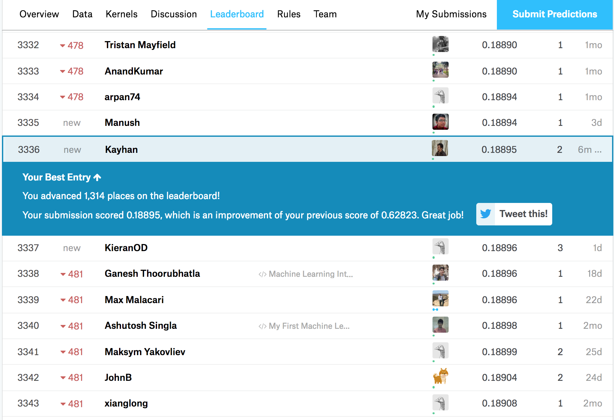

<div align="center">

</div>

> <p dir="RTL"> 
با توجه به داده های قیمت منازل
لطفا به سوالات زیر پاسخ دهید.
</p>

***
<p dir="RTL">
ابتدا باید پکیج های مورد نیاز را صدا بزنیم و داده ها را وارد کنیم:
</p>
```{r, eval=FALSE}
library(readr)
library(dplyr)
library(tidyr)
library(Hmisc)
library(corrplot)
library(ggplot2)
library(PerformanceAnalytics)
library(car)
train = read_csv("/Users/kayhan/Desktop/house/train.csv")
```
```{r include=FALSE, cache=FALSE}
library(readr)
library(dplyr)
library(tidyr)
library(Hmisc)
library(corrplot)
library(ggplot2)
library(PerformanceAnalytics)
library(car)
train = read_csv("/Users/kayhan/Desktop/house/train.csv")
```
***

<h5 dir="RTL">
۱. ماتریس همبستگی متغیرهای مختلف را به دست آورده و سپس رسم نمایید.
اعداد به دست آمده را با آزمون فرض معناداری همبستگی بسنجید و سپس ده متغیری که همبستگی بالاتری با قیمت دارند را مشخص نمایید.
</h5>

<h6 dir="RTL">
پاسخ:
</h6>

<p dir="RTL">
با استفاده از تابع 
rcorr 
در کتابخانه ی 
Hmisc، 
می توان به راحتی میزان همبستگی متغیرها و مقدار 
p-value 
آن ها را حساب کرد: 
</p>

```{r, warning=FALSE}
train %>%
  select(2:81) %>%
  select_if(is.numeric) %>%
  drop_na()->data

corrMatrix = rcorr(as.matrix(data)) 
```

<p dir="RTL">
حالا متغیر 
corrMatrix 
حاوی ماتریس همبستگی متغیرها و مقدار 
p-value 
آن ها است. از آن جا که ابعاد ماتریس زیاد است، برای نمایش آن از تابع زیر استفاده می کنیم:
</p>

```{r, warning=FALSE}
ReshapeCorrMatrix <- function(corr, pval)
{
  ut <- upper.tri(corr)
  data.frame(
    row = rownames(corr)[row(corr)[ut]],
    column = rownames(corr)[col(corr)[ut]],
    cor  =(corr)[ut],
    p = pval[ut]
  )
}
head(ReshapeCorrMatrix(corrMatrix$r, corrMatrix$P), 10)
```

<p dir="RTL">
که ده ردیف اول را نشان می دهید. برای تصویرسازی ماتریس همبستگی، از تابع 
corrplot 
در کتابخانه ی 
corrplot 
استفاده می کنیم:
</p>

```{r, warning=FALSE}
corrplot(corrMatrix$r, method = "square" , type = "lower", order = "original", 
         tl.col = "black", tl.cex=0.5, tl.srt = 45)
```

<p dir="RTL">
ده متغیری که بیشترین همبستگی را با قیمت فروش دارند هم عبارتند از:
</p>

```{r, warning=FALSE}
as.data.frame(corrMatrix$r) ->tmp
tmp = tmp[which(rownames(tmp) %in% c("SalePrice"))]
tmp %>% 
  mutate(SalePriceABS = abs(SalePrice), variable = rownames(tmp)) %>%
  arrange(-SalePriceABS) %>% 
  .[2:11,]->tmp

tmp$variable
```

***

<h5 dir="RTL">
۲. در یک تصویر نمودار پراکنش دو به دو ده متغیر بدست آمده به همراه قیمت را رسم نمایید و هم خطی بودن متغیرها را بررسی کنید
</h5>

<h6 dir="RTL">
پاسخ:
</h6>


<p dir="RTL">
ابتدا ۱۰ متغیری که بیشترین همبستگی با قیمت را داشتند به همراه خود متغیر قیمت را از داده ها جدا می کنیم:
</p>

```{r, warning=FALSE}
train %>%
  select("OverallQual", "GrLivArea", "GarageCars",   "GarageArea", "TotalBsmtSF",
         "1stFlrSF",     "FullBath", "TotRmsAbvGrd", "YearBuilt",  "YearRemodAdd", 
         "SalePrice") -> data
```
<p dir="RTL">
سپس برای بررسی هم خطی بودن متغیرها، این متغیرها را دو به دو برحسب هم رسم میکنیم. برای رسم این نمودار، از تابع 
chart.Correlation 
واقع در کتابخانه ی 
PerformanceAnalytics 
استفاده می کنیم:
</p>
```{r, warning=FALSE}
chart.Correlation(data, histogram=TRUE)
```
<p dir="RTL">
همچنین با استفاده از تابع 
scatterplotMatrix 
از کتابخانه ی 
car 
هم خواهیم داشت:
</p>
```{r, warning=FALSE}
scatterplotMatrix(data)
```
<p dir="RTL">
که نمودار بالا، نمودار پراکنش دو به دو متغیرهای تاثیرگذار بر قیمت می باشد.
</p>
***

<h5 dir="RTL">
۳. یک مدل خطی بر اساس ده متغیر برای پیش بینی قیمت برازش دهید. و سپس خلاصه نتایج مدل را به دست آورید.
</h5>
<h6 dir="RTL">
پاسخ:
</h6>
```{r, warning=FALSE}
train %>%
  select("OverallQual",         "GrLivArea", "GarageCars",   "GarageArea", "TotalBsmtSF",
         firstFlrSF="1stFlrSF", "FullBath",  "TotRmsAbvGrd", "YearBuilt",  "YearRemodAdd", 
         "SalePrice") -> mydata

model = lm(SalePrice ~ OverallQual + GrLivArea + GarageCars + GarageArea + TotalBsmtSF +
           firstFlrSF + FullBath + TotRmsAbvGrd + YearBuilt + YearRemodAdd, data = mydata)

summary(model)
```
***

<h5 dir="RTL">
۴. نمودار قیمت واقعی و قیمت پیش بینی را رسم نمایید و خوب بودن مدل را ارزیابی کنید.
</h5>
<h6 dir="RTL">
پاسخ:
</h6>
<p dir="RTL">
برای رسم ۴ نمودار معمول در بررسی مدل خطی، از دستور های زیر استفاده می کنیم:
</p>
```{r, warning=FALSE}
par(mfrow=c(2,2))
plot(model)
```
<p dir="RTL">
اما در اینجا به نمودار 
residuals-fits 
علاقه ی بیشتری داریم:
</p>
```{r, warning=FALSE}
res <- residuals(model)
plot(jitter(res)~jitter(SalePrice), ylab="Residuals", xlab="Price", data=mydata)
abline(0,0)
```
<p dir="RTL">
همانطور که مشخص است، برای خانه های با قیمت های بالا، فاصله ی قیمت واقعی از پیش بینی زیاد می شود و مدل ما خوب کار نمی کند. اما خانه هایی با قیمت متوسط را خوب پیش بینی می کند. نمودار قیمت پیش بینی بر حسب قیمت واقعی هم به این صورت است:
</p>
```{r, warning=FALSE}
mydata %>%
  mutate(PredictedPrice=1.960e+04*OverallQual + 5.130e+01*GrLivArea + 1.042e+04*GarageCars + 
           1.495e+01*GarageArea + 1.986e+01*TotalBsmtSF + 1.417e+01*firstFlrSF + -6.791e+03*FullBath +
           3.310e+01*TotRmsAbvGrd + 2.682e+02*YearBuilt + 2.965e+02*YearRemodAdd -1.186e+06) -> mydata

ggplot(mydata, aes(x=SalePrice, y=PredictedPrice)) + geom_point() +
  xlab("Sale Price")+
  ylab("redicted Price")+
  theme_bw()
```
<p dir="RTL">
که مطابق انتظارمان، مدل قیمت خانه هایی با قیمت بالا را کمتر از حد انتظار پیش بینی می کند و برای بهبود آن باید از مدل های غیرخطی استفاده کرد.
</p>
***

<h5 dir="RTL">
۵. مقدار
R-squared
 مدل را به دست آورید. آیا بر اساس این کمیت مدل به خوبی به داده ها برازش داده شده است؟
 کمیت
 F-statistic
 را در خلاصه مدل تفسیر نمایید.
</h5>
<h6 dir="RTL">
پاسخ:
</h6>

<p dir="RTL">
بیایید یکبار دیگر به خلاصه مدل نگاهی بیاندازیم:
</p>
```{r, warning=FALSE}
summary(model)
```
<p dir="RTL">
همانطور که مشخص است، میزان 
$R^{2}$
در مدل ما برابر با 
0.7721 
می باشد. می دانیم هرچه این عدد (که مقداری بین ۰ و ۱ دارد)، هرچه بیشتر به ۱ نزدیک باشد، نشانگر این است که پیش بینی ما به واقعیت نزدیک تر است و بنابراین در اینجا با مدل نسبتا خوبی مواجه هستیم.
</p>
<p dir="RTL">
همچنین مقدار 
F-statistic 
برابر با 
495.4 
می باشد که دارای 
p-value 
بسیار پایینی است. در واقع 
$Pr(F)$
بیانگر این است که با چه احتمالی این فرض که «همه ی متغیرهای دخیل در مدل، دارای ضریب ۰ باشند یا به عبارت دیگر، تفاوت نقاط صرفا از نویز خالص حاصل شود و متغیرها در میزان قیمت تاثیری نداشته باشند» چقدر است. با توجه به پایین بودن 
$Pr(F)$ 
میتوان نتیجه گرفت که حداقل برخی از متغیرهایی که در مدلمان استفاده کرده ایم، واقعا در میزان قیمت موثر اند.
</p>
***

<h5 dir="RTL">
۶. بر اساس
p-value
 سطح معناداری ضرایب تصمیم بگیرید که چه متغیرهایی در مدل سازی استفاده شود.
بر اساس متغیرهای جدید دوباره مدل سازی کنید و نتایج رو گزارش دهید.
</h5>
<h6 dir="RTL">
پاسخ:
</h6>
<p dir="RTL">
بیایید یکبار دیگر به خلاصه مدل نگاهی بیاندازیم:
</p>
```{r, warning=FALSE}
summary(model)
```
<p dir="RTL">
حالا تنها متغیرهایی که ۳ ستاره و ۲ ستاره هستند (پی ویلیویی کمتر از یک صدم دارند) را در نظر میگیریم و مدلمان را دوباره میسازیم:
</p>
```{r, warning=FALSE}
model = lm(SalePrice ~ OverallQual + GrLivArea + GarageCars + firstFlrSF +
           TotalBsmtSF + YearBuilt + YearRemodAdd, data = mydata)

summary(model)

par(mfrow=c(2,2))
plot (model)

mydata %>%
  mutate(PredictedPrice=1.949e+04*OverallQual + 4.768e+01*GrLivArea + 1.381e+04*GarageCars + 
           1.407e+01*firstFlrSF + 2.174e+01*TotalBsmtSF + 2.292e+02*YearBuilt + 
           2.768e+02*YearRemodAdd -1.075e+06) -> mydata

ggplot(mydata, aes(x=SalePrice, y=PredictedPrice)) + geom_point() +
  xlab("Sale Price")+
  ylab("redicted Price")+
  theme_bw()
```
<p dir="RTL">
همانطور که مشخص است، مدل جدید در میزان خوب بودن با مدل قبلی چندان تفاوتی ندارد اما از آن ساده تر می باشد.
</p>
***

<h5 dir="RTL">
۷. مدل خود را بر اساس باقی مانده نقص یابی کنید.
سه محک 
normality, independance, Constant Variance
 را در نقص یابی خود در نظر بگیرید.
</h5>
<h6 dir="RTL">
پاسخ:
</h6>
<p dir="RTL">
برای عیب یابی مدل، باید از نمودارهای عیب یابی استفاده کنیم. این نمودار ها را در سوال های قبل رسم کرده ایم. در این سوال مجددا آن ها را تحلیل می کنیم. به طور کلی در برازش یک مدل خطی به داده ها، ۴ فرض وجود دارد:
</p>
<p dir="RTL">
۱- خطی بودن رابطه
</p>
<p dir="RTL">
۲- ثابت بودن واریانس رزیجوال ها
</p>
<p dir="RTL">
۳- استقلال رزیجوال ها از هم
</p>
<p dir="RTL">
۴- نرمال بودن توزیع رزیجوال ها
</p>
<p dir="RTL">
نمودار نخست، نمودار 
residuals-fitted 
می باشد:
</p>
```{r, warning=FALSE}
plot(model, which=1)
```
<p dir="RTL">
همانطور که مشخص است، داده ها در نمودار بالا دارای یک الگو هستند. یعنی در خانه هایی با قیمت بالا، رزیجوال ها بزرگ می شوند که یعنی مدل خطی، مدل خیلی مناسبی برای برازش نیست. نمودار دوم، نمودار 
QQ-plot 
است:
</p>
```{r, warning=FALSE}
plot(model, which=2)
```
<p dir="RTL">
همانطور که مشخص است، داده ها در بازه ی مناسبی روی یک خط قرار گرفته اند و این بدان معنی است که فرض نرمال بودن توزیع رزیجوال ها، فرض درستی بوده است. نمودار سوم، نمودار 
Scale-Location 
است:
</p>
```{r, warning=FALSE}
plot(model, which=3)
```
<p dir="RTL">
همانطور که مشخص است، به ازای مقادیر بالاتر، نقاط بیشتر حول خط پراکنده شده اند. به نظر می رسد که فرض ثابت بودن واریانس رزیجوال ها، فرض درستی نبوده است:
</p>
```{r, warning=FALSE}
ncvTest(model)
```
<p dir="RTL">
که چون 
p-value 
بسیار پایین است، بنابر این واریانس رزیجوال ها به ازای قیمت های مختلف ثابت نیست. در نهایت هم برای تست استقلال رزیجوال ها از هم، از آزمون فرض 
Durbin-Watson 
استفاده می کنیم:
</p>
```{r, warning=FALSE}
durbinWatsonTest(model)
```
<p dir="RTL">
از آنجا که مقدار 
p-value 
بزرگ است، نمی توانیم فرض صفر (وابستگی رزیجوال ها به همدیگر) را رد کنیم . در نتیجه احتمالا رزیجوال ها از هم مستقل اند.
</p>
***

<h5 dir="RTL">
۸. داده ها را به پنج قسمت تقسیم کنید. بر اساس چهار قسمت مدل خطی را بسازید و صحت مدل را برای یک قسمت 
باقی مانده را تست کنید. خطای پیش بینی شما چقدر است؟
</h5>
<h6 dir="RTL">
پاسخ:
</h6>
<p dir="RTL">
ابتدا داده ها را به ۵ قسمت تقسیم می کنیم و مدل سازی را با ۷ کمیتی که پیش از این نیز از آن استفاده کردیم، روی ۴ قسمت انجام می دهیم. سپس مدل به دست آمده را برای پیش بینی قسمت پنجم از داده ها به کار می بریم:
</p>
```{r, warning=FALSE}
colnames(train)[44] <- "firstFlrSF"
mydata = split(train, sample(1:5, nrow(train), replace=T))
data = mydata[1:4]
data1 = do.call("rbind", data)
data = mydata[5]
data2 = do.call("rbind", data)
model = lm(SalePrice ~ OverallQual + GrLivArea + GarageCars + firstFlrSF +
             TotalBsmtSF + YearBuilt + YearRemodAdd, data = data1)
data2$PredictPrice = predict(model, data2)
data2 %>%
  mutate(error = (PredictPrice-SalePrice)/SalePrice, absError = abs(error)) -> data2
```
<p dir="RTL">
برای محاسبه ی میزان خطای پیش بینی، از رابطه ی زیر استفاده می کنیم:
</p>
$\frac{PredictedPrice-SalePrice}{SalePrice}$
<p dir="RTL">
هستوگرام خطاها به صورت زیر است:
</p>
```{r, warning=FALSE}
ggplot(data2, aes(x=error)) + geom_histogram(color="black", fill="blue") + theme_bw()
```
<p dir="RTL">
همچنین نمودار جعبه ای خطاها هم برحسب شرایط خرید، به صورت زیر است:
</p>
```{r, warning=FALSE}
ggplot(data2, aes(x=SaleCondition, y=error)) + geom_boxplot() + theme_bw()
```
<p dir="RTL">
به طور میانگین هم خطای پیش بینی برابر است با:
</p>
```{r, warning=FALSE}
cat(mean(data2$absError*100),"%")
```

***

<h5 dir="RTL"> 
۹. آیا قیمت ربط غیر خطی با یکی از ده متغیر استفاده شده دارد؟
بر اساس دستاوردهای خود مدل را بهتر نمایید.
</h5>
<h6 dir="RTL">
پاسخ:
</h6>
<p dir="RTL">
ابتدا مدلی با استفاده ااز توان اول و دوم هر ۱۰ متغیر میسازیم:
</p>
```{r, warning=FALSE}
model = lm(SalePrice ~ OverallQual + GrLivArea + GarageCars + GarageArea + TotalBsmtSF +
             firstFlrSF + FullBath + TotRmsAbvGrd + YearBuilt + YearRemodAdd + I(OverallQual^2) +
             I(GrLivArea^2) + I(GarageCars^2) + I(GarageArea^2) + I(TotalBsmtSF^2) +
             I(firstFlrSF^2) + I(FullBath^2) + I(TotRmsAbvGrd^2) + I(YearBuilt^2) +
             I(YearRemodAdd^2) , data = train)

summary(model)
```
<p dir="RTL">
سپس پارامترهایی که تاثیر چندانی در مدل نداشتند را از مدل حذف می کنیم و مجددا مدل را میسازیم:
</p>
```{r, warning=FALSE}
model = lm(SalePrice ~ OverallQual + GrLivArea + TotalBsmtSF +
             firstFlrSF + FullBath + YearBuilt + YearRemodAdd + I(OverallQual^2) +
             I(GrLivArea^2) + I(GarageCars^2)  + I(TotalBsmtSF^2) +
             I(firstFlrSF^2) + I(FullBath^2)   + I(YearBuilt^2) +
             I(YearRemodAdd^2) , data = train)

summary(model)

par(mfrow=c(2,2))
plot (model)
```
<p dir="RTL">
بیایید سوال قبل را بر روی مدل جدید مجددا اجرا کنیم:
</p>
```{r, warning=FALSE}
colnames(train)[44] <- "firstFlrSF"
mydata = split(train, sample(1:5, nrow(train), replace=T))
data = mydata[1:4]
data1 = do.call("rbind", data)
data = mydata[5]
data2 = do.call("rbind", data)

data2$PredictPrice = predict(model, data2)
data2 %>%
  mutate(error = (PredictPrice-SalePrice)/SalePrice, absError = abs(error)) -> data2

ggplot(data2, aes(x=error)) + geom_histogram(color="black", fill="blue") + theme_bw()

ggplot(data2, aes(x=SaleCondition, y=error)) + geom_boxplot() + theme_bw()

cat(mean(data2$absError*100),"%")
```
<p dir="RTL">
همانطور که مشخص است، مدل اندکی بهبود یافته است.
</p>
***

<h5 dir="RTL"> 
۱۰. بر اساس مدل نهایی به دست آمده نتایج پیش بینی خود را بر روی
test.csv
به دست آورید و در سایت 
kaggle
 در مسابقه 
 House Prices: Advanced Regression Techniques
بارگذاری نمایید. سپس لینک رتبه و عدد آن را ضمیمه تمرین کنید.
</h5>
<h6 dir="RTL">
پاسخ:
</h6>
<p dir="RTL">
لینک مسابقه:
</p>
[House Prices: Advanced Regression Techniques](https://www.kaggle.com/c/house-prices-advanced-regression-techniques)
<p dir="RTL">
لینک پروفایل من در 
kaggle:
</p>
[KayhanMomeni](https://www.kaggle.com/kayhanmomeni)
<p dir="RTL">
که پس از ثبت مدل بالا در این مسابقه، امتیاز 
0.18895 
و رتبه ی 
3336 
از 
4752
را کسب کردم!
</p>
<div align="center">

</div>